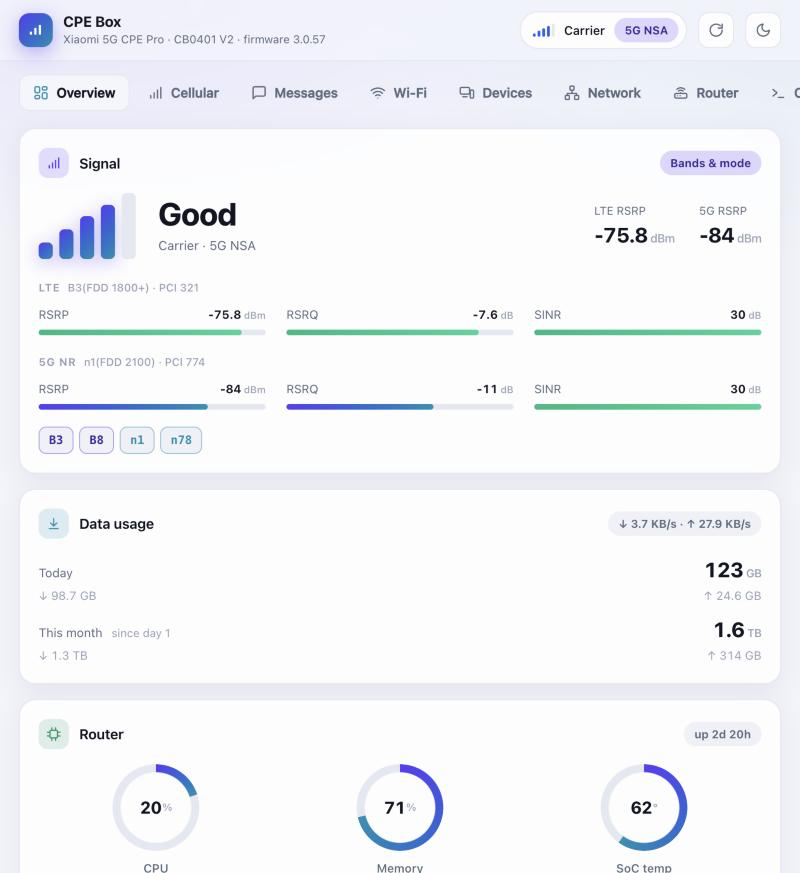
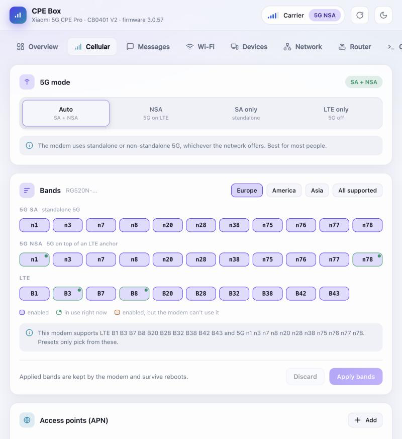
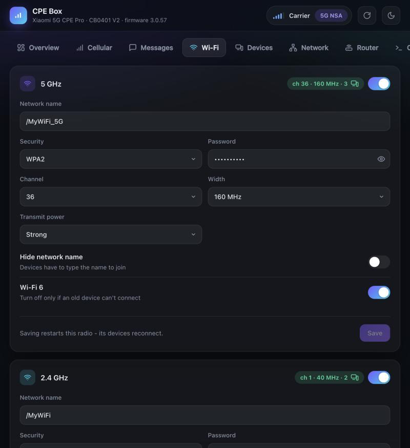
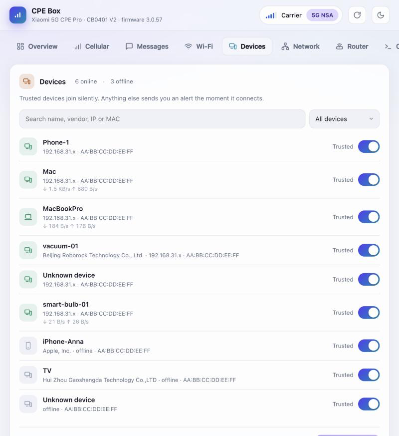
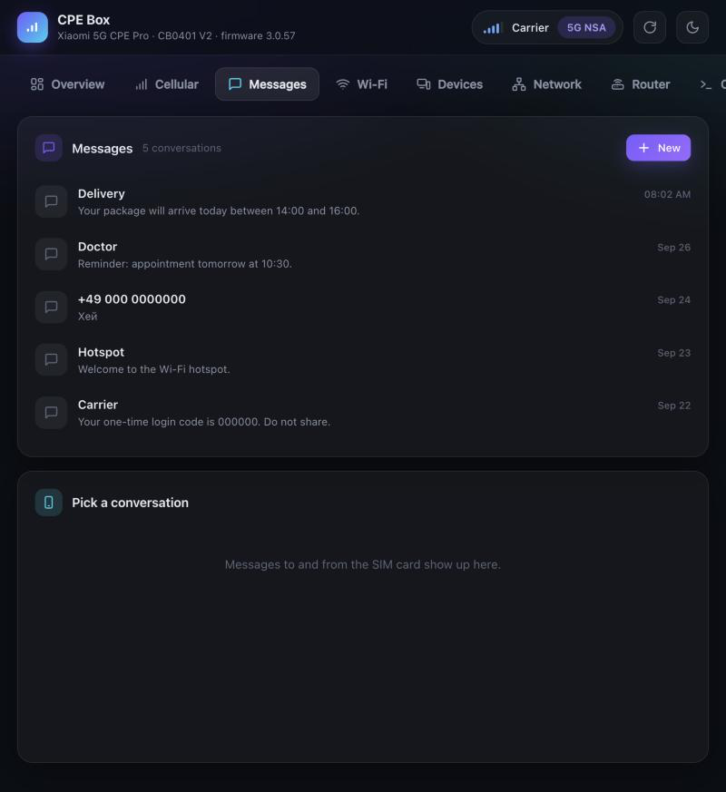
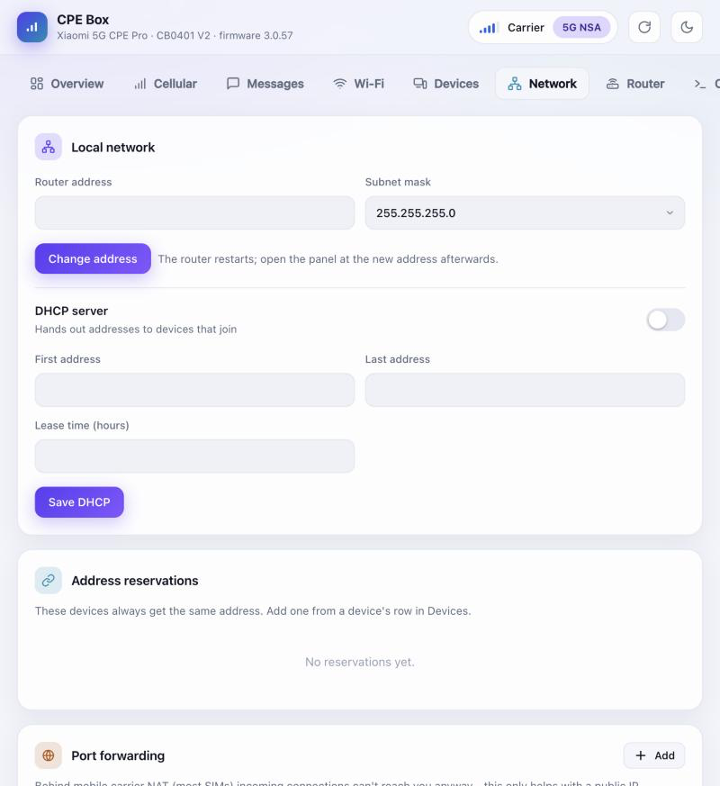
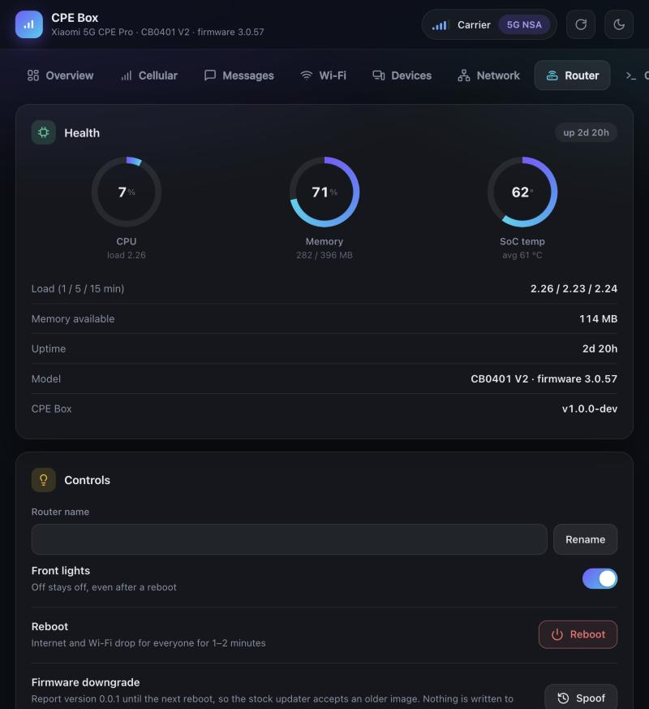

# CPE Box

A self-hosted setup script and web dashboard for the **Xiaomi 5G CPE Pro** router family — model **CB0401V2** (this project's own test device, sold under Deutsche Telekom's Magenta branding in Germany/Austria as the "Magenta Internet Box AX5400", used with any carrier SIM — the test device itself runs on an o2‑DE SIM) and, very likely, the original **CB0401** (v1): both share the same Qualcomm IPQ5018 SoC and Quectel RG520N-family modem, and are listed under the identical "Xiaomi 5G CPE Pro" name in xmir‑patcher's own device database — differing only in a modem firmware revision (R01 vs R03) that doesn't affect the AT-command surface this toolkit uses. Not independently verified on real CB0401 (v1) hardware, though.

For people who own the hardware and want to actually control it: persistent root SSH, a clean local admin panel for cellular / Wi‑Fi / device settings that the stock UI doesn't expose, and **removal of the telemetry and junk cron jobs the stock firmware phones home with by default**.

Everything runs **locally** and is **fully self-contained** — no third-party exploit tool, no Python required for the core setup. The GUI is a single native binary that binds to your LAN (any device on your Wi‑Fi opens `http://cpe.box`, signing in with the router's root password), driven entirely by SSH commands to your own router. Nothing here talks to any third-party server except the router itself and, if you turn on push notifications, either [ntfy.sh](https://ntfy.sh) or the Telegram Bot API (your choice).



## What this actually does

Run once, `start.sh` (macOS/Linux) or `start.ps1` (Windows) will:

1. Open persistent root SSH on the router (`bootstrap/open_ssh.sh` / `.ps1`) — see [How SSH access is opened](#how-ssh-access-is-opened) below for exactly how and why this works. Skipped if SSH already works; falls back to a password-based key install if it doesn't apply. A dedicated SSH key for the toolkit is installed in the same step, so every later step (and the GUI itself) never needs your password again.
2. Set up push notifications and remote device-block commands: pick either a random, private [ntfy.sh](https://ntfy.sh) topic (zero setup) or a Telegram bot (needs a token + your chat ID), wire an instant new-device alert straight into dnsmasq (fires the moment a device gets a DHCP lease, no polling), and start a small listener on the router that lets you reply with commands like `trust`, `block` or `red alert` to react from your phone (a one-line cron watchdog keeps it running). Switchable later from the panel's Devices page without re-running setup — see [Push notifications & remote commands](#push-notifications--remote-commands-optional).
3. Copy `router/cleanup.sh` onto the router and run it, removing telemetry uploads and dead cron jobs (see [What gets cleaned up](#what-gets-cleaned-up) below).
4. Install a small helper on the router (`router/install.sh`) that reapplies the cellular hooks, the SMS reader, and the notify listeners after every reboot.
5. Fetch the prebuilt `cpe-box` binary for your OS from the latest GitHub release (or build it from source if you have Go), then launch it at `http://cpe.box`. Any laptop or phone on the same Wi‑Fi opens the same URL.

Everything is idempotent — re-running `start.sh` is safe and just verifies/repairs each step.

## The dashboard

Pages, one job each:

**Overview** — signal (LTE + 5G, RSRP/RSRQ/SINR bars per link), operator + registration, active bands, data usage today and this month plus a live down/up rate pill, router health (CPU / memory / SoC temp / uptime), Wi‑Fi at a glance, connected devices at a glance. This is what someone opens to check that everything is working.

The Today and This month totals come from the modem itself (`mobile.flowstat.daily_usage` / `monthly_usage` in UCI, the same numbers the stock web UI shows) — the only counter on this SoC that isn't bypassed by the hardware flow-offload path. The kernel's `rx_bytes`/`tx_bytes` and `trafficd`'s WAN totals both live after the offload split, so they miss ~95% of the traffic and aren't used as the reported number; the down/up split shown under each is the modem total scaled by trafficd's own rx:tx ratio, which is a fair estimate of how that particular line divides download vs upload. If Today shows 100+ GB and you didn't stream anything, that's still the truth — check the same value in the stock UI via `uci get mobile.flowstat.daily_usage`.


**Cellular** — 5G mode selector (`SA+NSA auto` / `Force SA only` / `NSA only` / `LTE only` — see [SA vs NSA](#sa-vs-nsa-5g) for what these actually mean and their real-world limits), region-based band presets (Europe / America / Asia, built from GSMA/3GPP allocation tables and, for Europe, this project's own factory-default bands), raw band chips for full manual control via `AT+QNWPREFCFG`, APN switcher, mobile-data + roaming toggles, SIM PIN handling (unlock the SIM straight from the panel after a reboot without auto-PIN, unblock with PUK after too many wrong tries, change PIN), a live connection panel (operator, network, active carriers, LTE + 5G cells, APN, SIM state) — and an **IMEI editor** that reads the modem's current IMEI and writes a new one with `AT+EGMR=1,7,…` when a carrier gates SA to whitelisted device IDs (see the panel's own warning; not reversible to a factory value).



**Wi‑Fi** — 2.4 GHz and 5 GHz side by side: SSID, password, channel, width, hide-network, Wi‑Fi 6 on/off, live client count. Read-only TX power display (see [Known hardware limitations](#known-hardware-limitations) for why it's read-only). 2.4 GHz channel scan with a per-channel score that weighs both signal strength and overlap of every network the router can see, so the recommendation isn't just "the least-crowded exact channel". If the driver falls back from what you configured (typically 160 MHz on channel 36 narrowing to 80 MHz because of DFS), the form still shows your saved choice with a note next to it saying what's actually running — see [5 GHz 160 MHz and DFS](#5-ghz-160-mhz-and-dfs).



**Devices** — every device on the network, with a checkbox whitelist; unlisted devices trigger a push notification. A device with no DHCP hostname also gets a best-effort manufacturer name (from its MAC) and an mDNS-derived name if one answers — see [Identifying nameless devices](#identifying-nameless-devices). Live throughput per device. This is also where you switch between ntfy.sh and Telegram, update your Telegram bot token / chat ID, or turn incoming-SMS forwarding on/off, at any time — see [Incoming SMS](#incoming-sms).



**Messages** — SMS inbox and thread view for the SIM in the router, forwarded to your notification backend automatically ([Incoming SMS](#incoming-sms)). On Telegram, replying to a forwarded message sends a real SMS back to that number.



**Network** — router LAN address, subnet, DHCP server (range, lease time), address reservations, port forwarding rules, UPnP and DMZ toggles.



**Router** — real-time CPU / memory / SoC temp / uptime, reboot, front-lights toggle, router name (mDNS/DNS `.local` name devices see), open-on-your-phone URLs, root-password change (see [Changing the root password](#changing-the-root-password) for why the naive way doesn't work), SSH copy-paste commands with the right compatibility flags, and a version-spoof button that lifts the stock updater's downgrade block (memory-only, reverts on reboot — see [Firmware downgrade & 5G band unlock](#firmware-downgrade--5g-band-unlock)).



**Console** — raw SSH command box on the router (as root), plus an **AT command line straight to the modem** (Quectel RG520N over `/dev/ttyUSB2` via `microcom`, same channel the stock firmware's own `at_cmd.sh` uses) with preset chips for the queries that come up most often (`AT+QENG="servingcell"`, `AT+QNWPREFCFG=…`, `AT+CGSN`, etc.) and a full `uci show` config dump. Whatever the panel's own UI doesn't cover, you can drive from here.

## Opening the panel on your phone

Any device on the router's Wi‑Fi opens **`http://cpe.box`** — no port, nothing after it. cpe-box grabs port 80 for that on the machine it runs on, so the friendly name is enough. `cpe.lan` works the same way (same router-side DNS, kept as a fallback for browsers that skip your DNS resolver). If port 80 wasn't available to grab (Linux without `CAP_NET_BIND_SERVICE`, an already-taken port), the panel prints the alternate URL on launch — usually `http://cpe.box:7777`.

The machine that started the GUI is trusted automatically; every other device is asked for the router's root password once, then remembers the session for 30 days. Sessions are bound to the password they were issued under, so changing the root password from the panel logs every other device out.

The GUI never opens itself to the public internet — the LAN bind is only reachable from devices already on your Wi‑Fi. For remote access, run [`cloudflared`](https://developers.cloudflare.com/cloudflare-one/connections/connect-networks/) alongside it (`cloudflared tunnel --url http://127.0.0.1:7777`) with an authenticated Zero Trust policy in front. To keep the panel on `127.0.0.1` only (no LAN access), set `GUI_BIND=127.0.0.1:7777` in `panel/.env` before starting.

## How SSH access is opened

This isn't a novel exploit — it's documented Xiaomi router behavior that's been public knowledge in the router-hacking community for years. `bootstrap/open_ssh.sh`/`.ps1` try two paths automatically, in order:

**Path A — Telnet (firmware < 3.0.100, the common case):**

1. The router's web UI exposes an **unauthenticated** endpoint, `api/xqsystem/init_info`, which includes the device's serial number.
2. Xiaomi's own firmware-imaging tool (`mkxqimage`) derives a default root/Telnet password from that serial number: `md5(serial + "6d2df50a-250f-4a30-a5e6-d44fb0960aa0")`, first 8 hex characters. That salt is a hardcoded GUID with its segments reversed, found by reverse-engineering `mkxqimage` itself — not something this project invented.
3. Stock firmware ships with Telnet (port 23) always enabled, and root accepts that derived password.
4. The script logs in over Telnet and applies the same "soft" persistence patch used by xmir-patcher: enable dropbear (removing its release-build gate), set `nvram ssh_en=1`, install a cron job + firewall include hook that keep re-applying this every minute so it survives reboots, then install this toolkit's own SSH key directly.

**Path B — CVE-2023-26319 web exploit (firmware 3.0.100+, Telnet closed):**

Newer firmware closes Telnet, but the SmartController API has a command injection vulnerability: the `mac` field in `xqsmarthome/request_smartcontroller` is passed unsanitised into a 100-byte `sprintf()` → `system()` call. Injecting `;CMD;` runs CMD as root, up to ~20 characters per call. The bootstrap script:

1. Logs in to the web UI (same derived password, or set `WEB_PASSWORD=<password>` if you've changed it) to get a session token.
2. Writes a bootstrap script to `/tmp/e` on the router in 2-character chunks via repeated injection calls (`echo -n "XX">>/tmp/e`, three HTTP requests per chunk: `scene_setting`, `scene_start_by_crontab`, `scene_delete`).
3. Executes the script, which enables SSH and installs the toolkit's SSH key.
4. Installs persistence (ssh_patch.sh, cron job, firewall hook) via the now-open SSH connection.

This is the same mechanism [xmir-patcher](https://github.com/openwrt-xiaomi/xmir-patcher)'s `connect5.py` uses. The bootstrap script writes ~170 chunks (~510 HTTP requests), which takes roughly 3–5 minutes on a typical LAN connection.

**What the cron job and the firewall hook actually are.** Both paths leave two small pieces on the router, both pointing at one script, `/etc/crontabs/patches/ssh_patch.sh`. That script sets `nvram ssh_en=1`, removes the `"release"` check from `/etc/init.d/dropbear` so the SSH server is allowed to start on a retail build, then enables and restarts dropbear. It runs from a cron line (`*/1 * * * *`, every minute) and from a firewall include (`firewall.auto_ssh_patch`, which runs whenever the firewall reloads). The reason for two triggers is that the stock firmware can quietly turn SSH back off — after a reboot, or when it reapplies its own config — and either trigger notices and turns it back on. There's nothing else to configure: you never run or edit this by hand, and it only ever touches SSH.

**If both paths fail.** CVE-2023-26319 was patched in some firmware versions (the exploit is fully blocked when the router's `hackCheck` setting is 3). If both Telnet and the web exploit are refused, use [xmir-patcher](https://github.com/openwrt-xiaomi/xmir-patcher) once to open SSH, then run this toolkit as usual — everything after the first SSH connection only needs SSH. Because the toolkit's own key isn't installed yet in that case, `start.sh` will ask for the router's root password once.

## SA vs NSA 5G

The Cellular page's 5G mode selector writes `AT+QNWPREFCFG="nr5g_disable_mode"` directly on the modem:

| Value | Mode | Effect |
|---|---|---|
| `0` | SA + NSA (auto) | Modem attaches to whatever the network offers — in practice, almost always NSA if the network offers both |
| `1` | NSA only | SA disabled |
| `2` | Force SA only | NSA disabled — the modem will only attach to a standalone 5G core network |
| `3` | LTE only | 5G disabled entirely |

**NSA (Non-Standalone) and SA (Standalone) are two different registration types, not two flavors of the same thing:**

- **NSA** anchors on an LTE cell for control-plane signaling and uses 5G NR purely as extra downlink/uplink capacity bolted on top. This is what almost every "5G" icon on a phone actually means today.
- **SA** is a fully independent 5G registration against a genuine 5G-only core network — no LTE involved at all.

Setting `Force SA only` doesn't manufacture SA coverage that isn't there — if your carrier hasn't deployed a real SA cell at your location, the modem falls all the way back to plain LTE (both NSA and SA unavailable), even if NSA 5G otherwise works fine there. Confirmed by direct `AT+QENG="servingcell"` queries on the project's own test connection (Telekom.de): with mode `0`, a working connection reports `"NR5G-NSA"`; forcing mode `2` on the exact same cell dropped straight to plain `"LTE"`, with zero NR bands active — proof there was no SA cell to fall onto, not a bug in this toolkit. Check your carrier's 5G SA rollout before assuming this mode should give you a 5G icon — NSA is what most "5G" networks actually run today.

## Push notifications & remote commands (optional)

The router will ping you the instant an unrecognized device joins your network — the alert is wired directly into dnsmasq's own `--dhcp-script` hook (`dhcp_notify.sh`), which fires exactly once per DHCP lease granted, not on a polling timer. There's no delay waiting for a periodic check, and nothing runs on the router in between actual connection events. You can reply directly from the notification, and the reply is handled just as fast: `command_watcher.sh` runs as a small always-on listener that keeps one long-polling request to Telegram (or an open ntfy stream) waiting, so a reply is acted on within about a second. The connection sits idle in between (about 1 MB of RAM, no polling), and a once-a-minute cron watchdog restarts the listener after a reboot. The new-device alert also makes sure it's running the moment it fires.

| Reply | Effect |
|---|---|
| `trust` | Adds the last unrecognized device seen to the whitelist, so it never alerts again (and lifts its block, if it had one) |
| `<MAC or IP> trust` | Same, for a specific device |
| `block` | Blocks the last unrecognized device seen |
| `<MAC or IP> block` | Blocks that specific device (resolves an IP to its current MAC first, and blocks by MAC — an IP-only block would stop protecting the device the moment its DHCP lease changes) |
| `red alert` | Locks Wi‑Fi down to only the devices on your whitelist. This requires a full radio reload on this hardware, so it will briefly disconnect *every* device, including trusted ones — there's no way around that on this platform. |
| `all clear` | Removes the lockdown, back to normal |

You choose the delivery backend during setup (or later, from the panel's Devices page — the change takes effect within a minute, no re-running setup or restarting anything):

- **ntfy.sh** — zero setup: just install the free [ntfy app](https://ntfy.sh) and a random topic name is generated for you. The topic *is* the access control — anyone who knows it can read your alerts and send these commands, so treat it like a password. Since it's a shared pub/sub topic, the router's own outgoing alerts also come back to it; `command_watcher.sh` filters those out by their exact notification title so they aren't mistaken for a command.
- **Telegram** — create a bot with [@BotFather](https://t.me/BotFather) (free, one-time) to get a bot token, then message your new bot once so it can see your chat ID. Commands are only ever accepted from that one chat ID, which is a tighter access model than a shared topic string — and since a bot never receives its own outgoing messages back, there's no self-message filtering needed on this path.

Either way, the credential (ntfy topic, or Telegram bot token + chat ID) is stored only in `panel/.env` on your machine and `/etc/crontabs/patches/notify.conf` on the router — both gitignored/generated locally, never part of this repository.

The first time you set a backend up (or whenever you switch it, or change the Telegram token/chat ID), you'll get a one-time welcome message through it listing the commands above — so you don't have to come back to this README to remember them once an actual alert shows up.

`device_monitor.sh` is still on the router alongside `dhcp_notify.sh`, but only runs once during setup — it scans whatever's already connected at that point so those devices are seeded as "already seen" instead of all alerting at once the moment the dnsmasq hook goes live. After that, it's unused unless you re-run setup (or run it manually over SSH, as a re-scan).

"Already seen" isn't forever, though: a device you haven't whitelisted (or blocked) gets re-alerted if it reconnects more than 4 hours after its last alert. The 4-hour window exists specifically so a router reboot — which makes every already-connected device request a fresh lease at once, since the lease file itself lives on `/tmp` and doesn't survive one — doesn't look like all of them just showed up for the first time; it isn't meant to mean "you've decided about this device, don't ask again" the way whitelisting or blocking it does.

## Incoming SMS

If the number this SIM is on ever gets a text (a carrier notice, a 2FA code, anything), it's forwarded to your ntfy/Telegram backend too — the switch is on the panel's Devices page (on by default once you've set up a backend), and every message also shows up in the Messages page.

The stock firmware's own SMS handling (`/usr/sbin/mobile`) is compiled/encrypted Lua this project can't hook into or extend, so there's no equivalent of the dnsmasq hook above — `sms_notify.sh` polls instead, but cheaply: every 4 seconds it runs [`sms-reader`](router/sms-reader/) (a small, purpose-built, dependency-free Go program) against `/data/etc/mobile/xqSMS.db`, the small SQLite file that daemon already maintains. There's no `sqlite3` CLI on this router and installing one would mean either a multi-MB dependency or a foreign binary's libc against this firmware's userland — so `sms-reader` implements just enough of the SQLite file format to read new rows of that one known table, in a static binary built with `CGO_ENABLED=0` (no libc dependency of its own either). `setup.sh`/`setup.ps1` cross-build it for the router on the fly, the same way `start_gui.sh`/`.ps1` build the GUI itself — see [`router/sms-reader/build.sh`](router/sms-reader/build.sh) for the no-Go-installed fallback. See the program's own doc comment for the exact scope and what it deliberately doesn't try to handle (a table that's grown past a single b-tree page, essentially — not a realistic size for a personal SMS inbox).

Like the other listeners, `sms_notify.sh` runs under the same `--daemon`/`--ensure`/`--stop` convention with a once-a-minute cron watchdog, and a one-shot run at setup time seeds "already seen" from whatever's already in the database so it doesn't forward old messages the moment it goes live.

**Replying (Telegram only).** Reply directly to one of these forwarded "SMS from X" messages and your reply is sent back to X as a real text — quote-reply in Telegram, type your answer, done. This uses the stock firmware's own send path (`ubus call mobile sms '{"method":"send",...}'`, confirmed live to be a native, documented mechanism backed by `mobile_sms_send_message` over QMI to the modem, not an AT-command hack), so it works the same as texting from the phone this SIM would otherwise be in. `command_watcher.sh` matches the reply to the right number via a small `message_id → phone` map that `sms_notify.sh` writes when it forwards each SMS; it only applies to a real numeric sender, since an alphanumeric SMSC alias (e.g. a carrier's own "Telekom"-style sender ID) can't receive a reply at all. ntfy doesn't have an equivalent "reply to this specific message" concept, so this is Telegram-only.

## Identifying nameless devices

DHCP hostnames aren't always useful — some devices don't send one at all, and both iOS and Android now randomize their MAC address (and often the hostname with it) per network by default, specifically so a router can't reliably recognize or track them. When a device on the Devices page has no hostname, the panel tries two more things, both best-effort and both run from the panel itself (your own machine), not the router:

- **Manufacturer, from the MAC.** The first 3–4.5 bytes of most MAC addresses are an IEEE-assigned block identifying the manufacturer (embedded in the GUI binary — see [`panel/oui.go`](panel/oui.go) for where that data comes from). This is skipped entirely for a randomized address (checked via the address's own "locally administered" bit) — the address carries no real vendor info in that case, so even attempting a lookup would only ever produce a misleading coincidence, never a real answer.
- **A reverse mDNS query.** The panel asks the local network directly ("does anyone know a name for this IP?", the same query `dns-sd -q <ip>.in-addr.arpa` or `avahi-resolve` would make) — see [`panel/mdns.go`](panel/mdns.go). Some devices still answer this even with a randomized DHCP identity; plenty don't, by design.

**On macOS**, this needs the "Local Network" permission — a plain command-line binary like this one doesn't get the usual permission popup for it, so if manufacturer/mDNS names aren't showing up, check System Settings → Privacy & Security → Local Network and enable it for the `cpe-box` binary, then restart it. Windows/Linux don't have an equivalent gate.

## What gets cleaned up

By default (`sh cleanup.sh`, no flags), the following is disabled — all verified to have zero effect on routing, Wi‑Fi, or cellular functionality:

- **`sp_check.sh`** — a cron job that gzips and uploads `web.log` / `rom.log` / `privacy.log` / `pri_rom.log` to a Xiaomi telemetry endpoint every 5 minutes.
- **`otapredownload`** — automatic firmware pre-download, which also has the side effect of silently overwriting any manual firmware/config changes you've made.
- **`breakpad`** — Google Breakpad crash reporter, uploads crash dumps to Xiaomi.
- A couple of dead cron entries left over from other hardware variants (referencing scripts and directories that don't even exist on this firmware).

Two extra, opt-in flags exist for things that are genuinely useful for *some* people and not others:

- `--disable-mesh` — disables `cab_meshd` / `miwifi-discovery` / `miwifi-roam`, which run at boot unconditionally even if you have no Xiaomi Mesh satellite node paired. Skip this if you actually use Mesh.
- `--disable-messagingagent` — disables the router's MQTT connection to Xiaomi's cloud. This may be what the Mi Home app or your carrier's remote support tooling relies on — only disable it if you don't need either.
- `--all` — both of the above.

Pass these to `setup.sh`/`setup.ps1` via the `CLEANUP_FLAGS` environment variable (e.g. `CLEANUP_FLAGS=--all ./setup.sh`) so you don't need a manual follow-up SSH session.

**On persistence:** service disables (`--disable-mesh`/`--disable-messagingagent`/breakpad) only take effect through `/etc/init.d/X disable`, which lives on this router's ramfs-mounted `/etc` — confirmed live that they silently revert to "enabled" after a reboot, the same root cause as the [root password not sticking without the direct-write fix](#changing-the-root-password). `cleanup.sh` works around this the same way `bootstrap/open_ssh.sh` keeps SSH open: it installs a small cron job that reapplies the disables within a minute of every boot. The telemetry/dead-cron removals above don't need this — they edit `/etc/crontabs/root`, which is a symlink into persistent storage and survives reboots on its own.

## 5 GHz 160 MHz and DFS

The stock firmware ships with every DFS channel (52-140) in the radio's `channel_block_list`, so 160 MHz is impossible out of the box — a 160 MHz block from channel 36 always spans 52-64 (DFS), and the driver silently narrows to 80 MHz on channel 40 when it can't reach that range. In the EU there's no way to do 160 MHz without those DFS channels, and disabling the DFS radar detector in the firmware isn't possible (it's baked into the Qualcomm driver and is a regulatory requirement).

CPE Box's setup step drops that ban to just `165` (not usable in EU), sets `htmode=HT160`, and turns on `preCACEn` so the radio pre-CACs a set of DFS backup channels in the background — if a real radar hit ever knocks the current channel out, the driver hops to a channel that's already CAC-cleared within a beacon interval instead of the mandatory 60-second wait. All three settings are (re-)applied every boot by `router/wifi_dfs_persist.sh` (via `boot.sh`), so a firmware housekeeping pass or a wifi reload can't undo them.

Radar detection itself stays on, and if a real radar does hit the current channel the driver will move — coming back on its own once the NOL timer for that channel expires. If you'd rather never see a DFS-triggered channel move at all, go back to 80 MHz on channel 36-48 (all non-DFS in the EU).

## Known hardware limitations

These were all confirmed through direct testing on real hardware this project was built against, not assumed from documentation:

- **TX power cannot be changed from software.** `iw set txpower fixed` returns success but has zero measurable effect; the vendor `cfg80211tool s_txpow` returns `EINVAL`; `get_maxpower`/`get_minpower` are unimplemented stubs. The panel shows the real value read-only.
- **`qca_spectral`** is loaded and referenced by the driver stack, but exposes no usable userspace interface anywhere (checked `cfg80211tool`, `iwpriv`, and the full `debugfs` tree) — it appears to be purely an internal DFS radar-detection dependency, not something you can point at a spectrum analyzer.
- **No Docker/Entware/Node.js.** Persistent storage is a single ~20 MB partition; there simply isn't room, and the vendor's `opkg` feed is dead (404).
- **A `wifi reload` briefly drops every client**, trusted or not. This is triggered by changing Wi‑Fi channel/width and by the `red alert`/`all clear` commands — it's a platform limitation of this driver stack, not a bug in this toolkit.
- **The stock modem daemon's API varies by firmware, so the cellular panel has an AT fallback.** By default the panel reads live cell info and applies bands through the router's own modem daemon (`ubus call mobile ...`) — it's fast, and the daemon persists band choices across reconnect/reboot on its own. But older units (e.g. cb0401 v1, ROM 3.0.116) ship a daemon with a different method set: `dump_status` is missing there (the call fails with ubus status 3, `METHOD_NOT_FOUND`) and the band-set call is rejected outright (`{"code":-1}`). When the daemon path is unavailable, the panel automatically falls back to talking to the modem directly over AT — reading serving-cell info with `AT+QENG`/`AT+QNWINFO`/`AT+QCSQ` and setting bands with `AT+QNWPREFCFG` (also mirrored into the daemon's UCI so they survive a reboot). The daemon stays the preferred path where it works; the AT fallback is what keeps v1-class firmware working instead of showing a dead card stuck on "connecting…".

## Changing the root password

`/etc/shadow` is a symlink into the router's tiny persistent partition, but it sits under a `ramfs`-mounted `/etc` — a password change made the usual way (`passwd`, or editing that path) gets lost on the next reboot. The panel's "Change root password" button works around this by writing the new hash directly to `/data/etc/shadow` (the real persistent path the symlink points at) instead of going through `/etc/shadow` itself — confirmed live to survive a reboot, unlike the naive approach.

The GUI always logs in with its own SSH key first, and only falls back to a password (to silently reinstall the key) if the key stops working — for instance after a factory-reset-like event that wipes `/etc`. Whenever you change the password from the panel, it updates the toolkit's own `.env` in the same step, so that fallback keeps using the current password rather than the stale factory one. Because the panel itself signs you in with the router's root password, every browser you're logged in from on other devices is signed out — the current password is what proves you're allowed in.

This password fallback needs the `sshpass` tool, which `setup.sh` installs for you on macOS/Linux. It isn't available on Windows by default, so on Windows this one specific fallback is a no-op — the panel still works normally, and if the router ever does lose the key, just re-run `setup.ps1` to reinstall it.

## Getting started

### Prerequisites (both platforms)

- Your CB0401/CB0401V2 connected and reachable at its default gateway address, `192.168.31.1` (override with the `ROUTER_IP` environment variable if yours differs).
- An SSH client (`ssh`/`scp`) — already on macOS/Linux; on Windows, the built-in OpenSSH Client feature (present by default on Windows 10 1809+ and Windows 11; if `ssh` isn't recognized, enable it with `Add-WindowsCapability -Online -Name OpenSSH.Client~~~~0.0.1.0` from an admin PowerShell).

That's it — Go is optional (a prebuilt `cpe-box` binary is downloaded from the latest GitHub release if you don't have Go), and Python and xmir-patcher are not needed at all, for anything.

### macOS / Linux

```bash
git clone https://github.com/Kreal-exe/CPE-Box-cb0401
cd CPE-Box-cb0401
./start.sh
```

### Windows

```powershell
git clone https://github.com/Kreal-exe/CPE-Box-cb0401
cd CPE-Box-cb0401
powershell -ExecutionPolicy Bypass -File start.ps1
```

`start.sh`/`start.ps1` is the one command for everything, every time: it checks whether the SSH key already works against the router, and either runs the full `setup.sh`/`setup.ps1` (first run) or skips straight to launching the panel (every run after that) — no need to remember which script to use.

The full setup opens SSH automatically (see [How SSH access is opened](#how-ssh-access-is-opened)); if that doesn't apply to your router, it asks for the router's SSH password exactly once, during the one-time key installation step — enter the derived default password from that section, or whatever you've since changed it to. Every step after that uses the key. It will also ask you to pick ntfy.sh or Telegram for notifications (see [Push notifications & remote commands](#push-notifications--remote-commands-optional)); for a non-interactive run, set `NOTIFY_BACKEND=telegram` plus `TELEGRAM_BOT_TOKEN`/`TELEGRAM_CHAT_ID` (or leave `NOTIFY_BACKEND` unset for ntfy) as environment variables beforehand.

Once setup finishes, the panel opens automatically at `http://cpe.box` — and any other device on the same Wi‑Fi opens it at the same URL, signing in with the router's root password.

### Firmware downgrade & 5G band unlock

Both live as one-click buttons in the panel itself — no separate script, no xmir-patcher, since they only need the SSH access this toolkit already has:

- **Router page → "Spoof version → 0.0.1"** — lifts the stock web updater's downgrade block (Settings > Update > Local update), if you need to flash an older firmware version. Memory-only (a bind-mount), reverts on its own at the next reboot.
- **Cellular page → "Unlock extra 5G bands + SA"** — installs a permanent hook (adapted from [davidohne/xiaomi_cb0401](https://github.com/davidohne/xiaomi_cb0401)) that reapplies your band selection and 5G mode (see [SA vs NSA](#sa-vs-nsa-5g)) on the cellular modem on every `wan_2` reconnect, including after a reboot — the stock firmware doesn't otherwise remember either setting across a reconnect. Seeded from whatever's already configured the first time you install it (n1/n3/n7/n28/n38/n75/n78 and SA+NSA auto by default if nothing's been set yet); from then on, changing bands or the 5G mode from the Cellular page keeps the hook in sync, so a reconnect never reverts you back to a stale value.

Both modify firmware/modem configuration and aren't covered by the same idempotency guarantees as the rest of this toolkit — read the button's confirmation prompt before clicking.

## Security notes

- This project modifies firmware behavior on a device that may be leased from, or branded by, your carrier. Check your terms of service; use at your own risk.
- Opening SSH relies on a default password derived from your router's serial number (see [How SSH access is opened](#how-ssh-access-is-opened)) — this is stock Xiaomi firmware behavior, not something this project introduces, but it does mean anyone on your LAN who can reach the router's web UI before you run setup could derive that password too. Run setup promptly after unboxing/resetting the device.
- The panel binds to the LAN by default (`GUI_BIND=0.0.0.0:7777`) so any device on your Wi‑Fi can open it — sign-in with the router's root password gates every other device, and localhost is trusted automatically. To restrict access to just the machine that started it, set `GUI_BIND=127.0.0.1:7777` in `panel/.env` before starting. For remote access, a Cloudflare Tunnel (`cloudflared tunnel --url http://127.0.0.1:7777`) with an authenticated Zero Trust policy in front is a safer option than exposing the port directly.
- `panel/router_key`, `panel/router_key.pub`, and `panel/.env` (which holds the router's root password, the panel's own session secret, plus your ntfy topic or Telegram bot token) are generated locally by setup and are gitignored — never commit or share them.
- SMS forwarding (see [Incoming SMS](#incoming-sms)) means anything sent to this SIM — including 2FA/login codes — ends up in your ntfy topic or Telegram chat too. Turn it off from the Devices page if that's not something you want going through a third-party push service.
- The SMS reply feature means anyone who can reply in that Telegram chat can send a real text from this SIM's number to whoever originally texted it. That's normally just you, but it's worth remembering if you ever add someone else to the chat or the bot token leaks — it's not just read access to your messages at that point, it's send access too.
- The mDNS lookup in [Identifying nameless devices](#identifying-nameless-devices) sends a query packet to whatever device is at each nameless IP — a normal, unauthenticated DNS-style question any device on your LAN could equally send, and nothing this project didn't already have (it already talks to every device's IP indirectly, e.g. to notice it on the network at all), but still real traffic leaving the panel toward other devices, unlike everything else here which only ever talks to the router itself and your chosen notification backend.

## Older releases

- **v0.3.3 (legacy)** — the last release with the previous single-page GUI, before the CPE Box redesign. Only fix on top of v0.3.2 is that bands are applied through the router's stock modem daemon (`ubus call mobile device`) instead of raw AT commands, so the modem itself persists them across reconnects and reboots. Same binary name as before (`cb0401-tune-control-*`).

## License

MIT — see [LICENSE](LICENSE).
